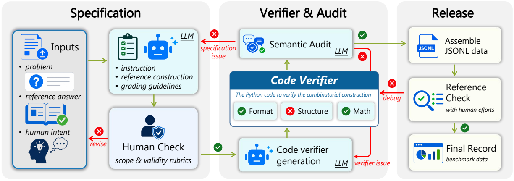

# ComBench: A Benchmark for Rigorous Proof Reasoning and Constructive Realization in Olympiad-Level Combinatorics

<p align="center">
  <a href="docs/assets/pipeline.pdf">
    
  </a>
</p>

<p align="center">
  <a href="#"></a>
  <a href="https://simplified-reasoning.github.io/ComBench/docs/"></a>
  <a href="https://github.com/Simplified-Reasoning/ComBench"></a>
  <a href="#"></a>
  <a href="#"></a>
</p>

ComBench is an Olympiad-level combinatorics benchmark for evaluating two
complementary capabilities in large language models: rigorous proof reasoning
and constructive realization. It combines rubric-guided proof judging with
deterministic verifier-gated scoring for construction-centric records.

## News

- **2026-06-08**: Project page and public code release are available.
- arXiv, Hugging Face dataset, and Hugging Face Daily Paper links will be
  updated after the corresponding public resources are created.

## Introduction

ComBench contains 100 human-annotated competition-level combinatorics problems:
50 analysis-centric records and 50 construction-centric records. Each record
contains problem metadata, reference answers, and problem-specific grading
guidelines. Construction-centric records additionally require explicit witness
payloads checked by deterministic Python verifiers.

The benchmark is designed to diagnose cases where proof quality and construction
validity diverge. A model may produce a fluent high-scoring proof while failing
to realize the required combinatorial object in a checkable form.

## Leaderboard

| Model | Analysis Avg. | Analysis Best@4 | Construction Avg. | Construction Best@4 | Overall Avg. | Overall Best@4 |
|---|---:|---:|---:|---:|---:|---:|
| GPT-5.5 | **62.4** | **72.9** | **68.4** | 77.7 | **65.4** | **75.3** |
| Gemini-3.1-Pro | 56.1 | 69.7 | 64.5 | 78.3 | 60.3 | 74.0 |
| Kimi-K2.6 | 43.5 | 60.6 | 63.4 | **83.7** | 53.5 | 72.1 |
| DeepSeek-V4-Pro | 37.8 | 56.6 | 52.6 | 67.7 | 45.2 | 62.1 |
| Qwen3.6-Max | 21.4 | 32.9 | 28.4 | 39.1 | 24.9 | 36.0 |
| SU-01 | 20.9 | 30.3 | 28.8 | 41.1 | 24.8 | 35.7 |
| GLM-5.1 | 21.6 | 36.0 | 25.6 | 37.1 | 23.6 | 36.6 |
| Qwen3.6-35B | 17.9 | 26.6 | 22.7 | 32.0 | 20.3 | 29.3 |
| Nemotron-Cascade | 21.8 | 32.9 | 17.4 | 28.0 | 19.6 | 30.4 |
| Gemma-4-31B-IT | 16.1 | 24.3 | 17.5 | 30.9 | 16.8 | 27.6 |

All values are percentages. Construction-centric scores use the verifier-gated
rule described in the paper.

## Repository Contents

- `src/`: generation, parsing, judging, scoring, and verifier execution code.
- `pipeline/`: utilities and prompt templates for building ComBench-style JSONL
  records.
- `data_process/`: utilities for inspecting JSONL records and checking reference
  constructions.
- `profiles/`: model profile examples. Profiles reference API keys through
  environment variable names only.
- `examples/`: a small toy JSONL record for local smoke tests.
- `tests/`: unit tests for the evaluation framework.
- `docs/`: static project page served by GitHub Pages.

## Setup

This project currently targets Python 3.10 or earlier.

```bash
python -m pip install -r requirements.txt
```

Run the unit tests:

```bash
python -m pytest tests
```

## Run

The mock profile does not call an external API. This command checks the
generation path only:

```bash
python -m src.main \
  --dataset examples/example.jsonl \
  --model-profile mock \
  --profiles-dir profiles \
  --output-root outputs_smoke \
  --generate \
  --verbose summary
```

The local verifier can be smoke-tested separately:

```bash
python data_process/check_ref_construction.py --file examples/example.jsonl --line 1
```

`outputs_smoke/` is ignored by git.

## Using LLM Profiles

LLM profiles are OpenAI-compatible chat-completions configurations. They should
not contain real API keys. Instead, set `api_key_env` to the name of an
environment variable:

```yaml
name: openai-compatible-example
type: llm
model_name: your-model-name
base_url: "https://api.example.com/v1/"
api_key_env: OPENAI_API_KEY
temperature: 0.6
timeout: 1200
max_retries: 8
```

Then set the key in your shell before running:

```bash
export OPENAI_API_KEY="..."
```

On Windows PowerShell:

```powershell
$env:OPENAI_API_KEY="..."
```

## Dataset Format

Each JSONL record contains an IMO-style problem and optional construction
metadata. Plain proof-only records use fields such as:

- `id`
- `query`
- `ref_answer`
- `grading_guidelines`
- `ref_solution`

Construction-centric records additionally include:

- `instruction`
- `ref_construction`
- `verify_code`

When both `instruction` and `verify_code` are present, the evaluator expects a
two-part response and checks the construction payload with the verifier.

## Citation

```bibtex
@misc{combench2026,
  title        = {ComBench: A Benchmark for Rigorous Proof Reasoning and Constructive Realization in Olympiad-Level Combinatorics},
  author       = {Zhang, Shunkai and Zhang, Haoran and Luo, Yun and Cheng, Qianjia and Lei, Haodi and Li, Yizhuo and Zhan, Runzhe and Wang, Zhilin and Xu, Bangjie and Su, Yucheng and Han, Xinmiao and Qu, Xiaoye and Liu, Dongrui and Lin, Zhouchen and Qiao, Yu and Ding, Ning and Li, Yafu and Cheng, Yu},
  year         = {2026},
  note         = {Preprint coming soon}
}
```

## Notes

- The complete ComBench dataset and paper result artifacts are intentionally not
  part of this code-only repository yet.
- Large model outputs and evaluation caches should stay outside git.
- The local construction verifier uses the vendored `src/prime_code/` runtime.
